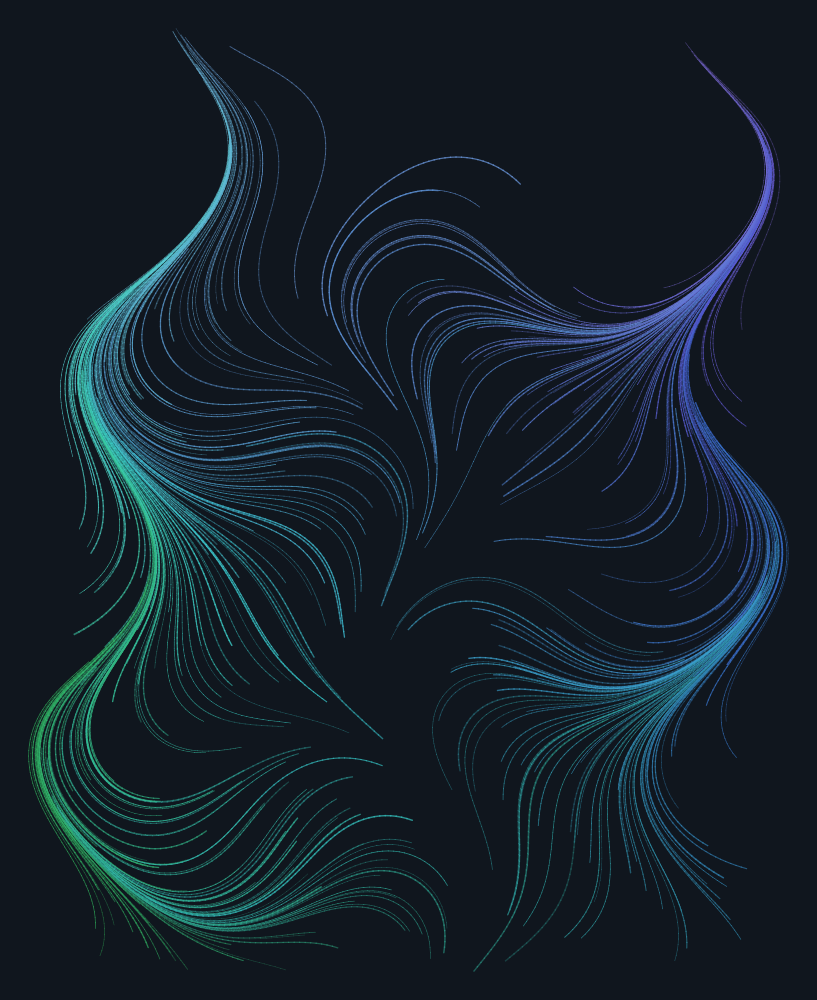
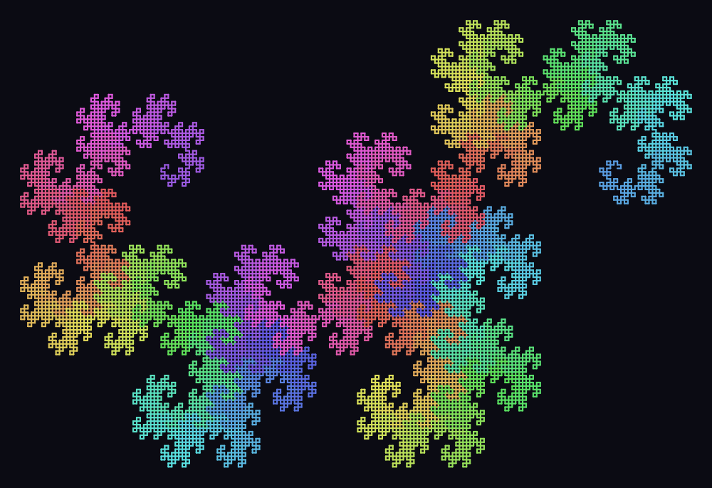
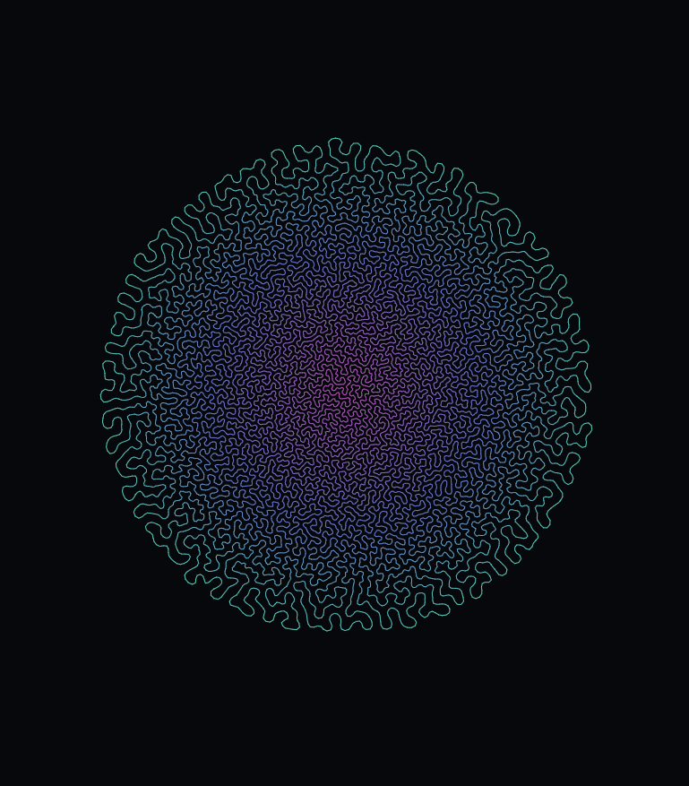

# A day of Grammarian

**25.07.2026.** Three empty folders, three sessions — two languages, and one
curve that folds itself into coral. None had a brief beyond *build whatever you
want*, and none was built for anyone.

---

## [`nfsharp/`](nfsharp) — NF#

A small statically typed functional language: lexer, parser, Hindley–Milner
type inference, and a tail-call-optimising evaluator, in about 2,900 lines of
dependency-free TypeScript.

```
$ nf -e "fun f g x -> f (g x)"
val it : ('a -> 'b) -> ('c -> 'a) -> 'c -> 'b = <fun>
```

Nothing is annotated unless you want it to be — every type is reconstructed
from the shape of the code. 249 tests.

→ [README](nfsharp/README.md) · [language reference](nfsharp/LANGUAGE.md)

---

## [`loom/`](loom) — Loom

A tiny concatenative language for drawing. Words push numbers onto a stack and
steer a turtle; the turtle leaves ink; the ink becomes an SVG. Zero
dependencies, including the anti-aliased rasteriser and PNG encoder.

| | | | |
| --- | --- | --- | --- |
|  |  |  |  |

```loom
: limb ( len depth -- )
  -> d  -> len
  d 0 > [
    len fd
    { 12 30 randr rt   len 0.66 0.82 randr *   d 1 -  limb }
    { 12 30 randr lt   len 0.66 0.82 randr *   d 1 -  limb }
  ] if ;
```

45 tests. Eight programs in [`loom/examples/`](loom/examples), rendered into
[`loom/out/`](loom/out).

→ [README and language reference](loom/README.md)

---

## [`growth/`](growth) — Differential Growth

One closed loop of points, three rules, and length injected at random edges.
Nothing in the rules mentions folding — the structure falls out of the fact
that the curve cannot pass through itself, so new length has nowhere to go but
sideways. One self-contained HTML file, no build step and no network.



That is a single unbroken loop of about 18,000 points. You can trace one strand
from the fringe into the core without lifting your finger.

Repulsion is all-pairs by definition; a uniform spatial grid built as a counting
sort into flat typed arrays takes it from ~25 µs per point per step to ~0.6 µs,
which is the difference between a few hundred points and twenty thousand.

→ [README](growth/README.md)

---

## The rest

- [`colophon.md`](colophon.md) — how the NF# session actually went, written
  from inside it.
- [`predictions.md`](predictions.md) — a pre-registration written before these
  sessions ran. Its interpretation belongs to whoever wrote it, not to this
  README; see the note at the bottom of that file, and the commit history here.

## Running them

```bash
cd nfsharp && npm test         # 249 tests, needs Node 23.6+
cd loom && python test_loom.py # 45 tests, written and run on Python 3.12
```

Growth needs nothing at all — open [`growth/differential-growth.html`](growth/differential-growth.html)
in a browser. `space` pauses, `R` restarts, `S` saves a PNG.

No project here has a dependency to install.
