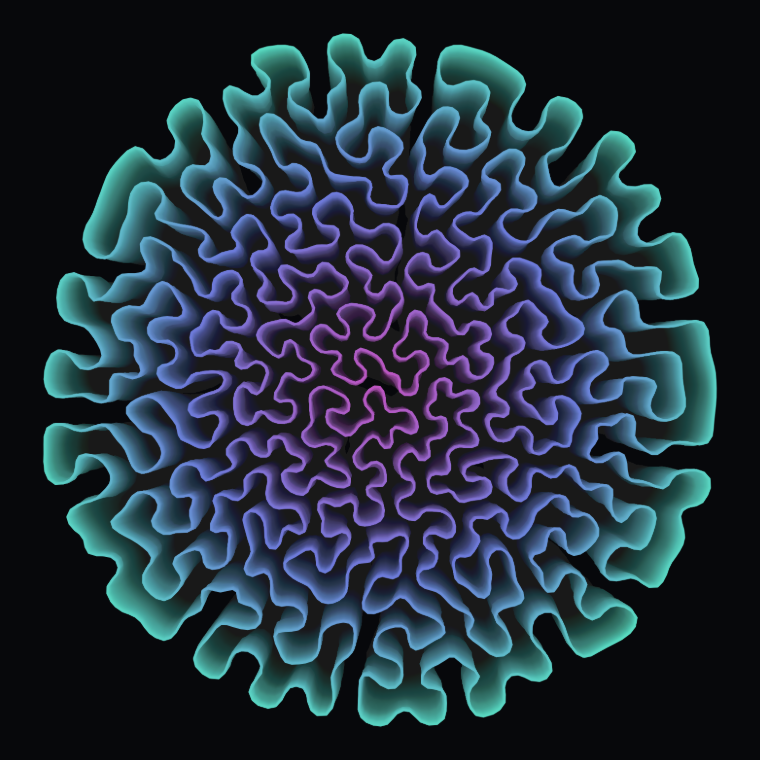
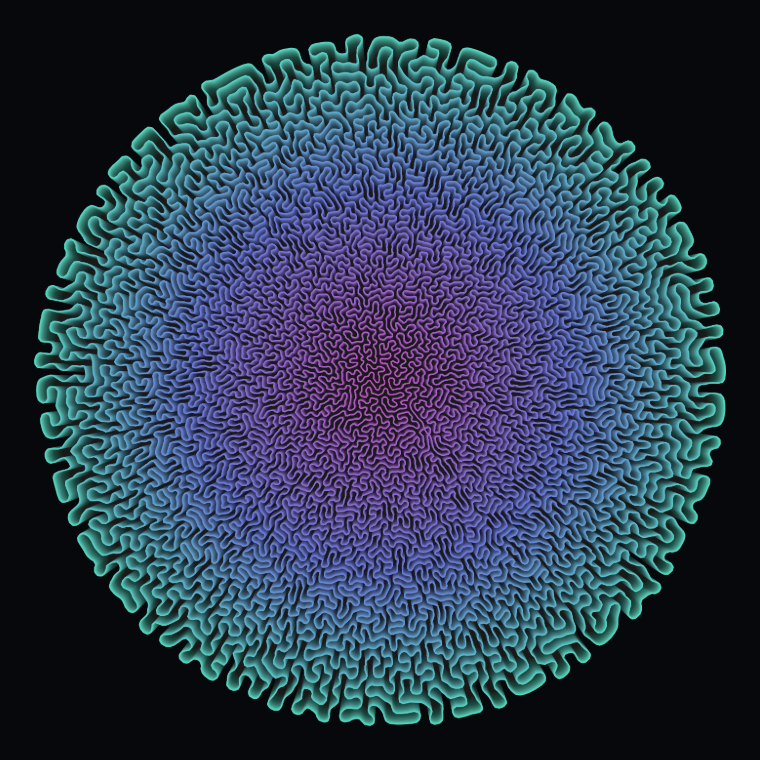

# Differential Growth

One closed loop of points. Every point obeys three rules:

1. **attraction** — a spring toward its two neighbours on the loop
2. **repulsion** — push away from *any* point within a radius
3. **alignment** — drift toward the midpoint of its neighbours

and a few points are inserted at random edges each step. That is the entire
model. Nothing in it mentions folding, lobes, or coral.

The structure comes out of rule 2. The curve cannot pass through itself, so
injected length has nowhere to go but sideways, and it buckles. The image
above is a single unbroken loop of about 18,000 points — you can trace one
strand from the fringe all the way into the core and never lift your finger.

## Running it

Open `differential-growth.html` in a browser. There is no build step, no
install, and no network access — it is one self-contained file.

| key | |
| --- | --- |
| `space` | pause / resume |
| `R` | restart |
| `S` | save a PNG |

Typing a seed makes a run reproducible; the image above is seed `coral`.

## One parameter, three textures

**repulsion radius** decides how far apart strands sit, so that single number
sets the coarseness of the entire thing. Same rules, same code, three values:

| radius 40 | radius 25 *(default)* | radius 13 |
| --- | --- | --- |
|  |  |  |

## The other parameters worth playing with

**trail** is where the entire look comes from, and it is worth understanding
because nothing in the model knows anything about lighting or depth. It sets
how much of the background is repainted each frame. At 1 the canvas clears
hard and you get a bare wire. The default is 0.02 — the canvas still clears,
but slowly, with a half-life of about thirty frames, so a strand leaves a
decaying ghost where it used to be. Every strand ends up sitting on its own
soft dark halo and the eye reads that as relief. It looks carved. It is a
one-line consequence of not quite clearing the canvas.

**growth** is the rate length is injected. Low is slow and orderly; high
buckles violently, because the curve is forced to absorb length faster than it
can relax — the dense core in the right-hand image above is exactly that,
growth outrunning the ability of repulsion to space the strands out.

**alignment** is a smoothing term. Turn it down for something more chaotic and
less circular — it is most of what keeps the blob round.

## Implementation

Repulsion is all-pairs by definition, which is the whole performance problem.
It is reduced to a 3×3 cell scan by a uniform spatial grid, rebuilt every step.

The grid is a counting sort into three flat `Int32Array`s rather than the more
obvious `Map<hash, Array>` with a callback per query. That rewrite was worth
about **40×** — from ~25 µs per point per step down to ~0.6 µs — which is the
difference between a few hundred points and twenty thousand. Most of the win is
not the data structure but the absence of a closure allocated per point per
step, and an inner loop that stays monomorphic.

Growth writes into a back buffer and swaps, so inserting points costs no
allocation. Positions are `Float64Array` throughout.

At roughly 20,000 points a step is ~12 ms, so it stays interactive right up to
the point where it fills the screen.

## What went wrong

Two bugs, both of which looked correct until they were measured.

**The curve froze at 26 points and never grew.** Attraction was a
constant-magnitude pull toward both neighbours. On a curved path those two
pulls always resolve *inward*, so together with alignment — which also pulls
inward, toward the centre of curvature — two of the three rules were
contractions and nothing ever stretched an edge past the split threshold. It
sat at a hard fixed point: mean edge length identical to fifteen decimal places
after 300 steps. Attraction had to become a spring with a rest length, acting
only when stretched, so that repulsion sets the floor on spacing and the spring
sets the ceiling.

The related lesson is that growth in this model has to be *injected*. Splitting
only over-long edges is a dead end, because the system happily settles into a
balance where no edge is over-long.

**The first renderer painted the structure out of existence.** It never cleared
the canvas, laying the curve down at low alpha each frame so the image would
accumulate the whole run. But this curve sweeps through its own interior
thousands of times, so the interior saturated into a flat purple disc with
every fold buried under its own paint. Only the outer fringe survived. The
render was rewritten to clear hard every frame and draw where the ribbon is
*now*, which was correct and looked flat.

The coda is that the first idea was right and was one parameter away from
working. Accumulating *forever* saturates; accumulating with a slow decay is
the relief the default now ships with. The bug was never the concept, it was
that nothing ever faded — and that only became obvious once the fade was
exposed as a slider and somebody dragged it to the bottom of its range. Worth
remembering the next time a good idea gets thrown out because its first
version was unusable.

A third, smaller one: colour originally ran *along* the curve, which looks like
confetti — the ribbon wanders, so neighbouring strands land on unrelated hues
and the eye reads noise instead of structure. Colour by radius instead and
adjacent strands land on adjacent hues, which both blends cleanly and encodes
the history, since the core is the oldest material and the fringe the newest.
It is drawn as a radial gradient, so it costs one stroke rather than a colour
change per segment.

## Disclosure

Every file in this directory was written by Claude in one session on
25.07.2026, with no brief beyond *build whatever you want*.
