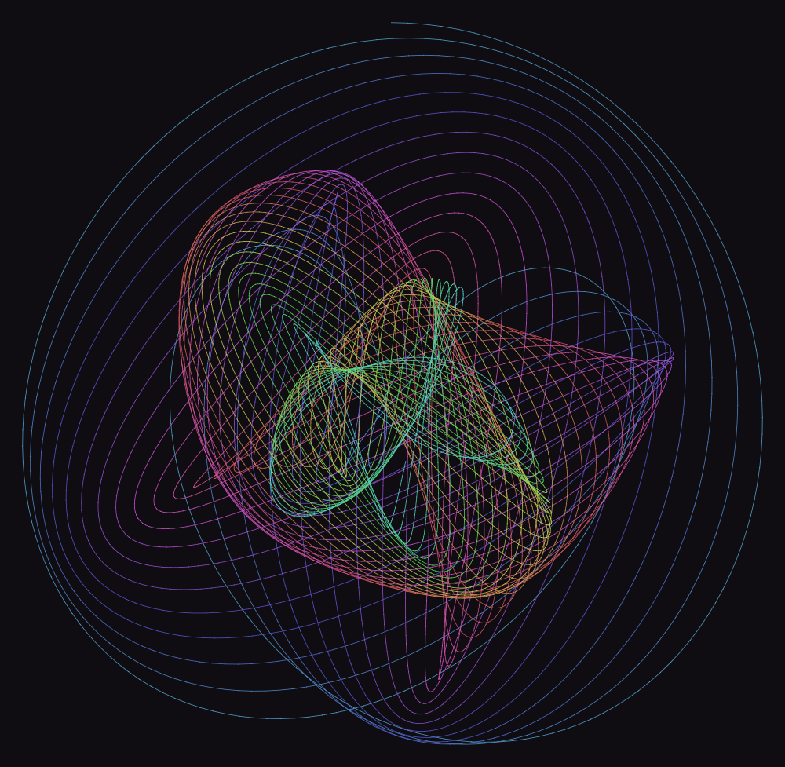
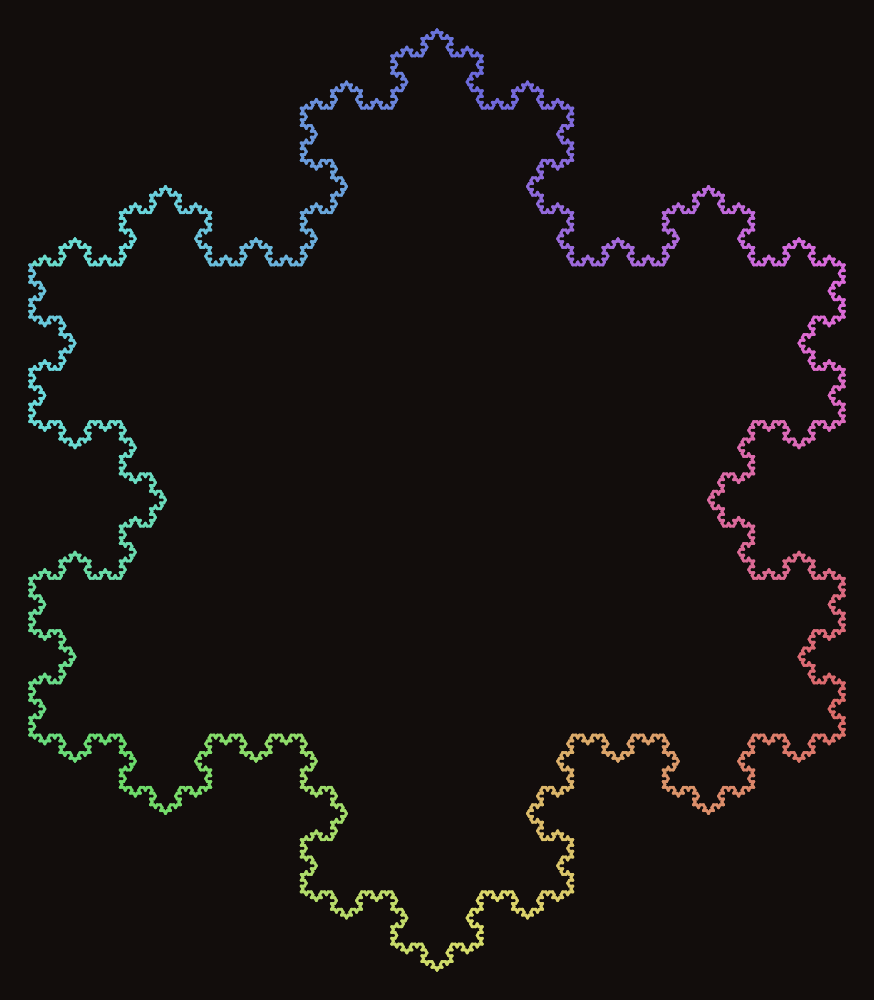
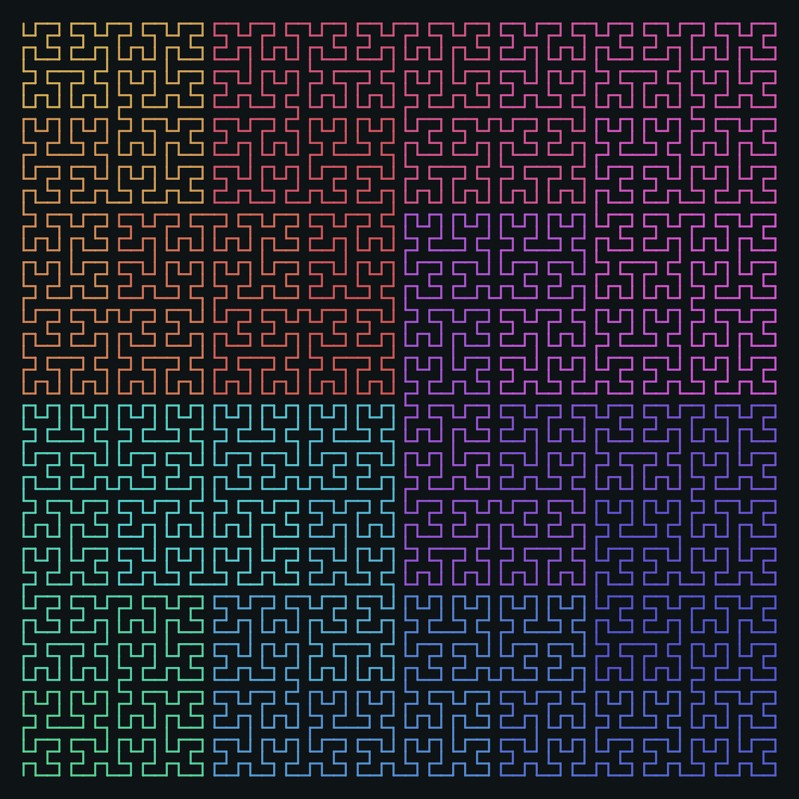
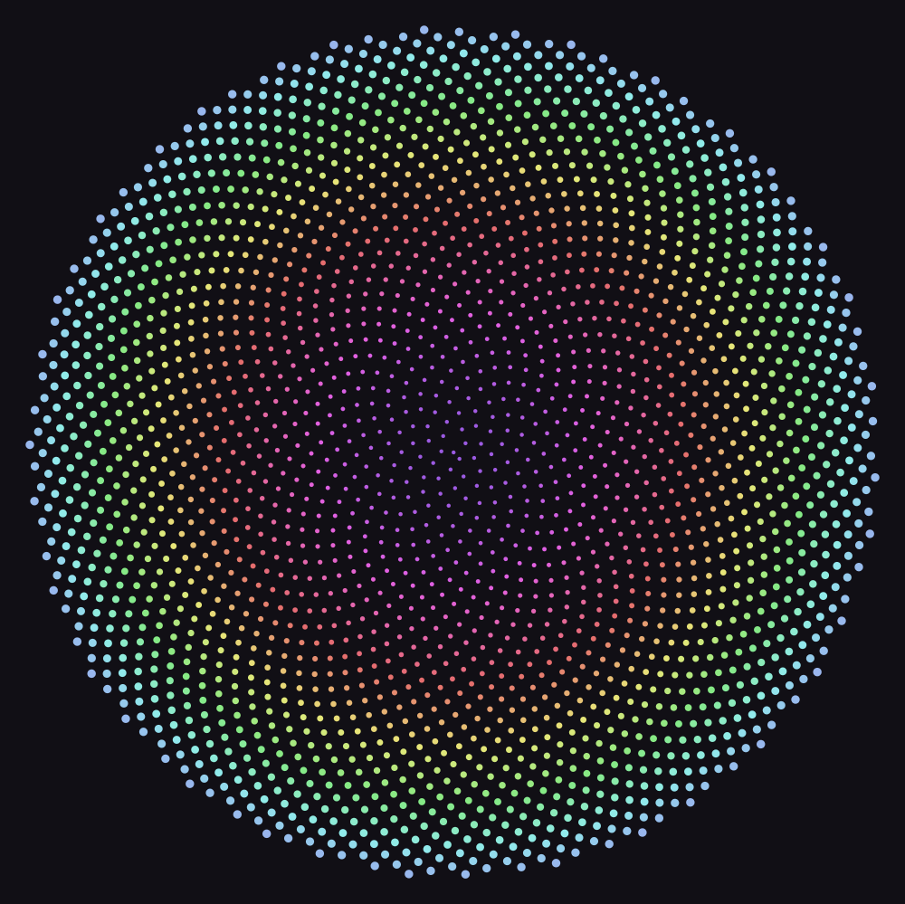

# Loom

A tiny concatenative language for drawing.

| | | | |
| --- | --- | --- | --- |
|  |  |  |  |

A Loom program is a stream of whitespace-separated words. Words push numbers
onto a stack, pop them off again, and steer a turtle across a plane. The
turtle leaves ink; the ink becomes an SVG.

```loom
2.2 width
3 [ 620 5 side  120 rt ] times
```

Nothing is imported. The interpreter, the rasteriser and the PNG encoder are
all standard-library Python, which means the whole thing is four files and no
install step.

```bash
python loom.py gallery --png
```

---

## Running it

| command | what it does |
| --- | --- |
| `python loom.py run FILE [-o OUT]` | render one program. `.png` output rasterises, anything else writes SVG |
| `python loom.py gallery [--png]` | render every `examples/*.loom` into `out/`, plus a contact sheet at `out/index.html` |
| `python loom.py repl` | type words, watch the stack, `save pic.svg` when you like it |
| `python test_loom.py` | the test suite |

Useful flags: `--size N` (longest side, default 1000) and `--seed N` (the
starting seed for `rand`).

---

## The model

Three things exist at once.

**A stack.** Numbers are the only scalar; blocks are the only other value.
There are no strings, no arrays, no objects. `2 3 +` leaves `5`.

**A turtle.** It has a position, a heading, a pen that is either down or up,
and a colour, width and alpha it paints with. Heading `0` points north and
`rt` turns clockwise, so `90 rt` faces east.

**A canvas.** Every stroke the turtle draws is appended in order. Consecutive
strokes that share a style and meet end-to-start are merged into one
polyline, which is why a 16,000-segment dragon curve fits in 280 KB.

The world has y growing upward. The flip into screen coordinates happens once,
at render time, in `Canvas.layout`.

---

## Syntax

There are six pieces of syntax and everything else is a word.

```loom
42  -3.5  .25        numbers push themselves

: name ... ;         define a word
[ ... ]              a block: pushed on the stack, not run yet
-> x                 pop into a local variable
=> x                 pop into a global variable
# to end of line     comment
( nestable )         comment
```

Definitions cannot nest. Blocks can nest as deep as you like.

### Scope

Calling a **word** pushes a fresh frame, so `-> x` inside a word is local to
that call and recursion behaves the way you would hope:

```loom
: fact -> n
  n 1 <= [ 1 ] [ n 1 - fact n * ] ifelse ;
6 fact                          # 720
```

Running a **block** does not push a frame. A block sees the locals of
whatever word it appears in, which is what makes `ifelse` and `times` usable
inside a definition at all.

Reading a name looks in the current frame, then in the global frame. Writing
chooses explicitly: `->` is local, `=>` is global. That distinction earns its
keep when you want a counter that survives across recursive calls — every
example that sweeps a hue along a path uses one.

Builtins cannot be shadowed. `: fd ... ;` and `1 -> width` are both errors,
caught at parse time.

---

## Words

**Stack** — `dup ( a -- a a )`, `drop`, `swap ( a b -- b a )`,
`over ( a b -- a b a )`, `nip ( a b -- b )`, `rot ( a b c -- b c a )`,
`2dup ( a b -- a b a b )`, `depth`, `clear`

**Arithmetic** — `+ - * / mod pow min max atan2 hypot` (binary),
`neg abs sqrt floor ceil round ln exp` (unary),
`sin cos tan` (unary, **degrees**), `atan2` returns degrees

**Constants** — `pi tau phi true false`

**Comparison** — `< > <= >= = <> and or not`. Zero is false, anything else is
true; comparisons yield `1` or `0`.

**Control**

| word | stack | effect |
| --- | --- | --- |
| `call` | `blk --` | run the block |
| `if` | `c blk --` | run it if `c` is non-zero |
| `ifelse` | `c blk1 blk2 --` | run `blk1` if `c`, else `blk2` |
| `times` | `n blk --` | run it `n` times |
| `while` | `cblk bblk --` | run `bblk` while `cblk` leaves non-zero |
| `i` / `j` | `-- n` | index of the innermost / next-out loop |

**Turtle** — `fd`, `bk`, `hop` (move without drawing), `rt`, `lt`,
`face ( deg -- )`, `heading ( -- deg )`, `goto ( x y -- )` (draws),
`jump ( x y -- )` (doesn't), `home`, `xy ( -- x y )`, `pu`, `pd`

`{` pushes the entire turtle state — position, heading, pen, style — and `}`
pops it back. Branching structures are `{ ... }` and nothing else:

```loom
{ 25 rt  len 0.7 *  d 1 - limb }
{ 25 lt  len 0.7 *  d 1 - limb }
```

**Style** — `hsl ( h s l -- )`, `hue`, `sat`, `light`, `alpha ( 0..1 -- )`,
`width`, `bg ( h s l -- )`. Hue wraps, saturation and lightness are
percentages and clamp.

**Marks** — `dot ( r -- )` fills a circle at the turtle. `begin-fill` starts
recording the turtle's path and `end-fill` closes it into a polygon, which
works whether or not the pen is down.

**Randomness** — `seed ( n -- )`, `rand ( -- 0..1 )`,
`randr ( lo hi -- x )`, `chance ( p -- 0|1 )`. Seeded per run, so a program
is a reproducible description of a picture and not merely a hint at one.

**Debugging** — `.` prints the top of the stack, `.s` prints the whole stack.

---

## The gallery

Eight programs in `examples/`, rendered by `python loom.py gallery`.

| | |
| --- | --- |
| `koch.loom` | the snowflake, from the one rule it needs |
| `tree.loom` | a stochastic tree; `{ }` doing the branching |
| `dragon.loom` | fourteen paper folds, opened out |
| `hilbert.loom` | 4096 cells in one line — the colour bands show why it's called space-*filling*, and why nearby stretches stay nearby |
| `phyllotaxis.loom` | 137.507764°, the angle sunflowers found first |
| `sierpinski.loom` | filled polygons and depth-first recursion |
| `harmonograph.loom` | two detuned pendulums and a slow precession |
| `wind.loom` | 420 particles integrating a flow field |

| | | | |
| --- | --- | --- | --- |
|  |  |  |  |

---

## How it's put together

| file | |
| --- | --- |
| `loom.py` | lexer, parser, interpreter, canvas, SVG writer, CLI |
| `raster.py` | anti-aliased rasteriser and PNG encoder, `zlib` and arithmetic only |
| `test_loom.py` | 44 tests, no framework |
| `examples/` | the gallery sources |

The parser produces four term types — `Num`, `PushBlock`, `Ref`, `Store` —
and the evaluator is a loop over them. Definitions are looked up by name at
call time rather than bound at parse time, which is what lets a word call
itself.

The rasteriser computes coverage the honest way: for each pixel in a
primitive's bounding box, measure the distance from the pixel centre to the
shape and use it as alpha. Round caps and joins fall out of that for free,
and it costs about two seconds for the entire gallery.

### Limits, deliberately

Recursion stops at 1200 frames, a drawing stops at 600,000 primitives, and a
program stops at 40 million steps. Runaway recursion is the normal failure
mode of a language like this, and it should say so rather than swallow all
the memory in the machine.

Errors carry the token that caused them:

```
examples/koch.loom:14:7: stack underflow  (at `+`)
```
